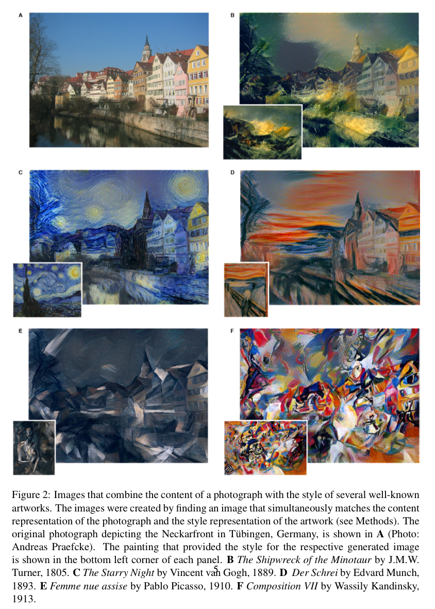
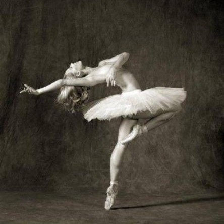
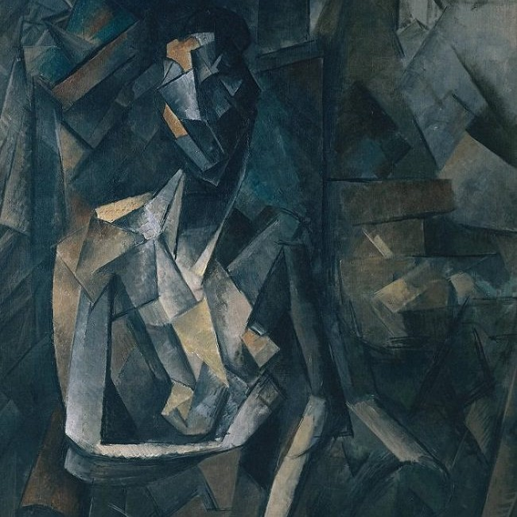
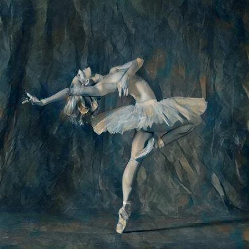

# Neural Style Transfer

📄 PyTorch implementation of "A Neural Algorithm of Artistic Style" (arXiv:1508.06576)


## Table of Contents

- [Background](#background)
    - [Model architecture](#model-architecture)
    - [Optimization method](#optimization-method)
    - [Loss function](#loss-function)
        - [Content loss function](#content-loss-function)
        - [Style loss function](#style-loss-function)
        - [Total loss function](#total-loss-function)
- [Dependencies](#dependencies)
- [Experiments](#experiments)
    - [Hyper-parameters](#hyper-parameter)
    - [Optimizer](#optimizer)
    - [Model](#model)
    - [Generated Artwork](#generated-artwork)
- [References](#references)


## Background

<p align="center">
  
</p>

In order to generate images, we take advantage of backpropagation to minimize the loss value. We call the input image which the art style will be transfered to **content image**, and the art style image is called **style image**.

We initialized generated image to be random noise. Then we pass the initialized generated image, style image and content image to the neural network model which its parameters are pre-trained using ImageNet as mentioned in the paper.


### Model architecture

The feature space is provided by the `16` convolutional and `5` pooling layers of the **`19` layer VGG Network** without any of fully connected layers.

For image synthesis, the max-pooling operation is replaced by average pooling improves the gradient flow and one obtains slightly more appealing results.


### Optimization method

- For content image, perform gradient descent on a **white noise image** to find another image that **matches the feature responses of the original image**.
- For style image, perform gradient descent from a **white noise image** to find another image that **matches the style representation of the original image**.


### Loss function

#### Content loss function

let $\overrightarrow{p}$ and $\overrightarrow{x}$ be the original image and the image that is generated and $P^l$ and $F^l$ their respective feature representation in layer $l$. We then define the **squared-error loss** between the two feature representations

$$
\mathcal{L}_{\text{content}}(\overrightarrow{p}, \overrightarrow{x}, l) = \frac{1}{2} \sum \limits_{i,j} (F_{ij}^{l} - P_{ij}^{l})^2.
$$

where $F_{ij}^{l}$ is the activation of the $i_{th}$ filter at position $j$ in layer $l$, where $F_{ij}^{l} \in \mathcal{R}^{N_l \times M_l}$. A layer with $N_l$ distinct filters has $N_l$ feature maps each of size $M_l$, where $M_l$ is the *height* times the *width* of the feature map.

#### Style loss function

Style representation computes the **correlations between the different filter responses**, where the expectation is taken over the spatial extend of the input image.


The feature correlations are given by the **Gram matrix** $G^l \in \mathcal{R}^{N_l \times M_l}$, where $G_{ij}^l$ is the inner product between the vectorised feature map $i$ and $j$ in layer $l$:

$$
G_{ij}^l = \sum \limits_{k} F_{ik}^l F_{jk}^l
$$


What we do is to minimize the mean-squared distance between the entries of the Gram matrix from the **original image** and the Gram matrix of **the image to be generated**. let $\overrightarrow{a}$ and $\overrightarrow{x}$ be the original image and the image that is generated and $A^l$ and $G^l$ their respective style representations in layer $l$.


The contribution of that layer to the total loss is then

$$
E_l = \frac{1}{4 N_l^2 M_l^2} \sum \limits_{i,j} (G_{ij}^{l} - A_{ij}^{l})
$$

and the total loss is 

$$
\mathcal{L}_{\text{style}} (\overrightarrow{a}, \overrightarrow{x}) = \sum \limits_{l=0}^{L} w_l E_l
$$


where $w_l$ are weighting factors of the contribution of each layer to the total loss.

#### Total loss function

Jointly minimize the distance of a white noise image from the content representation of the photograph in one layer of the network and the style representation of the painting in a number of layers of the CNN. So let $\overrightarrow{p}$ be the photograph and $\overrightarrow{a}$ be the artwork. The loss function to be minimized is

$$
\mathcal{L}_{\text{content}}(\overrightarrow{p}, \overrightarrow{a}, l) = \alpha \mathcal{L}_{\text{content}}(\overrightarrow{p}, \overrightarrow{x}) + \beta \mathcal{L}_{\text{style}} (\overrightarrow{a}, \overrightarrow{x})
$$

where $\alpha$ and $\beta$ are the weighting factors for content and style reconstruction respectively, weight factor $w_l$ was always equal to one divided by the number of active layers with a non-zero loss-weight $w_l$.


## Dependencies

```
torch
PIL
scipy
```

## Experiments

### Hyper-parameters


### Optimizer

I use the Adam optimizer to minimize total loss. We iteratively update our output image such that it minimizes our loss: we don't update the weights associated with our network, but instead we train our input image to minimize loss. As for the L-BFGS optimizer, which if you are familiar with this algorithm is recommended.

```python
    def _init_optimizer(self, input_img):
        """Initialize LBFGS optimizer."""
        self.optimizer = optim.LBFGS([input_img.requires_grad_()])
```


### Generated Artwork

|       Content Image       	|       Style Image       	|     Output Image     	|
|:-------------------------:	|:-----------------------:	|:--------------------:	|
|  	|  	|  	|


## References

[1] Shubhang Desai, [Neural Artistic Style Transfer: A Comprehensive Look](https://medium.com/artists-and-machine-intelligence/neural-artistic-style-transfer-a-comprehensive-look-f54d8649c199)  
[2] Raymond Yuan, [Neural Style Transfer: Creating Art with Deep Learning using tf.keras and eager execution](https://medium.com/tensorflow/neural-style-transfer-creating-art-with-deep-learning-using-tf-keras-and-eager-execution-7d541ac31398)  
[3] Shubham Jha, [A brief introduction to Neural Style Transfer](https://towardsdatascience.com/a-brief-introduction-to-neural-style-transfer-d05d0403901d)  
[4] Adrian Rosebrock, [Neural Style Transfer with OpenCV](https://www.pyimagesearch.com/2018/08/27/neural-style-transfer-with-opencv/)